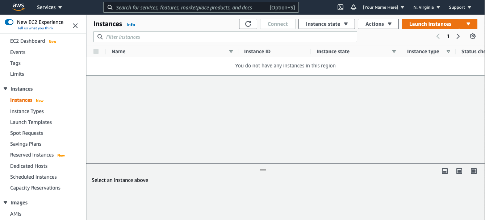
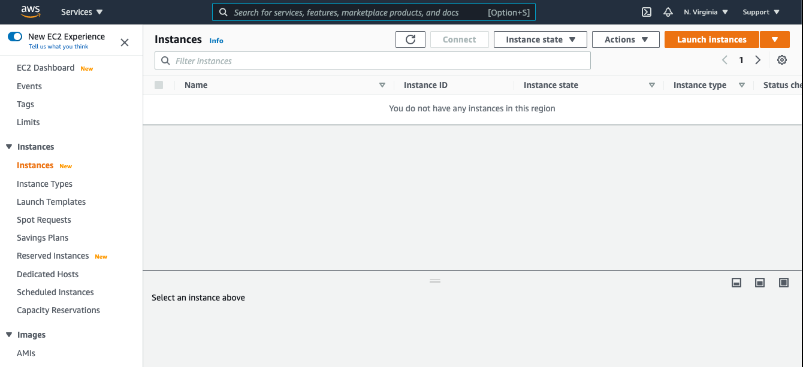

# Hide AWS User ID and Account ID

## Description

Tampermonkey script to hide user name and AWS Account ID / Alias on The top nav bar of AWS console.  

> Please note that in the current format, this removes the entire navigation feature that is underneath the AWS user name and account ID.  You will not be able to navigate to "My Account", "My  Organizations", etc.

## Compatibility
* Chrome
* Firefox

You will need to install Tampermonkey on Chrome or Firefox for this script to work. 

For ore details please visit the respective sites:
- [Tamperonkey Website](https://www.tampermonkey.net/)
- [Chrome Tampermonkey Extension](https://chrome.google.com/webstore/detail/tampermonkey/dhdgffkkebhmkfjojejmpbldmpobfkfo?hl=en)
- [Firefox Tamperonkey Add-on](https://addons.mozilla.org/en-US/firefox/search/?q=tampermonkey)

# Demo

Account Displayed

Account Not Displayed

Account Not Displayed

