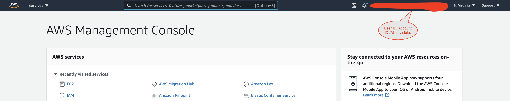
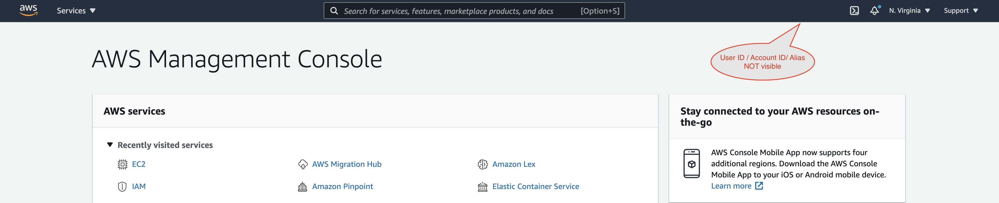

Tampermonkey script to hide user name and AWS Account ID / Alias on The top nav bar of AWS console.  Please note that in the current format, this removes the entire navigation features that is underneath this AWS user name and account ID - you won't be able to navigate to "My Account", "My  Organizations", etc.
 

### "Regular" AWS Console view showing AWS account information: ###

 

### AWS Console view with NOT showin AWS account information - using this Tampermonkey script ###

 
To use, simply copy paste this script to your Tampermonkey.  (Click on Tampermonkey icon --> Create New Script --> Copy contents from "hide-aws-user-id-account-id.js" and save)

 
 
You will need to install Tampermonkey on Chrome web browser for this script to work. For more details look at:
 
1. https://www.tampermonkey.net/
 
2. https://chrome.google.com/webstore/detail/tampermonkey/dhdgffkkebhmkfjojejmpbldmpobfkfo?hl=en

 
 
This script is tested only on Chrome.  
